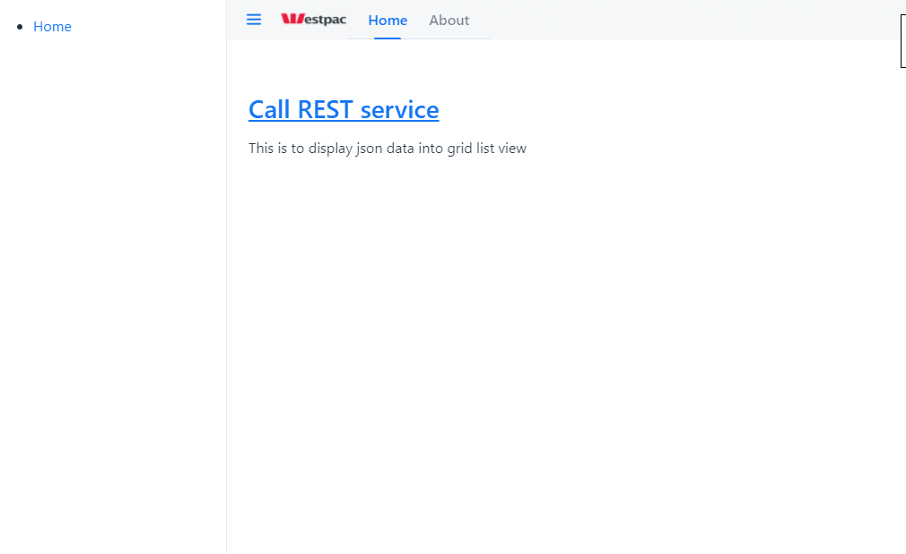

#SpringBoot application for using REST services with Vaadin

[Fetch the data from RestAPI service with Vaadin and SpringBoot] 
- [GitHub](https://github.com/skhare994/SpringBootRestAPI_Web_App)

[]

This application demonstrates to connect Spring Boot application to a REST API in Backend and Display Result in Front End. 
I am using Fake Rest API for Json data: [https://jsonplaceholder.typicode.com](https://jsonplaceholder.typicode.com)
 
Application main class is Application.java

UI main class is MainLayout.java

## Running the Application

Download the project as a Zip or connect though Git Repo (HTTPS, SSH, GitHub CLI)

Import the project to the IDE of your choosing as a Maven project.

Run the application using `mvn spring-boot:run` or by running the `Application` class directly from your IDE.

Open http://localhost:8181/ in your browser.

`NOTE: ` Make sure you have setup the JDK and Maven path at your System environment( JAVA_HOME and MAVEN_HOME) 

	
	* A favorite text editor or IDE
	* JDK 1.8 or later (Recommended JDK 11)
	* Maven 3.2+
	* You can also import the code straight into your IDE: 
	  Spring Tool Suite (STS)
	  IntelliJ IDEA

Steps to Run the application are as follows:

Run the Application Directly in springboot:

	1. Open the Project folder in command prompt and execute `mvnw spring-boot:run`

Run the Application jar:

	1. Open the Project folder in command prompt and execute `mvnw clean package` and then `java -jar target/gs-consuming-rest-0.1.0.jar`
 
Run the Application in IDE:

	1. Import the Project in your IDE and navigate to application.java class and run as 'SpringBoot App'

Go to browser and type [http://localhost:8181/](`http://localhost:8181/`)

#More Information

- [JDK Setup](https://confluence.atlassian.com/conf75/setting-the-java_home-variable-in-windows-1004947839.html)
- [Maven Setup](https://maven.apache.org/guides/getting-started/windows-prerequisites.html)

